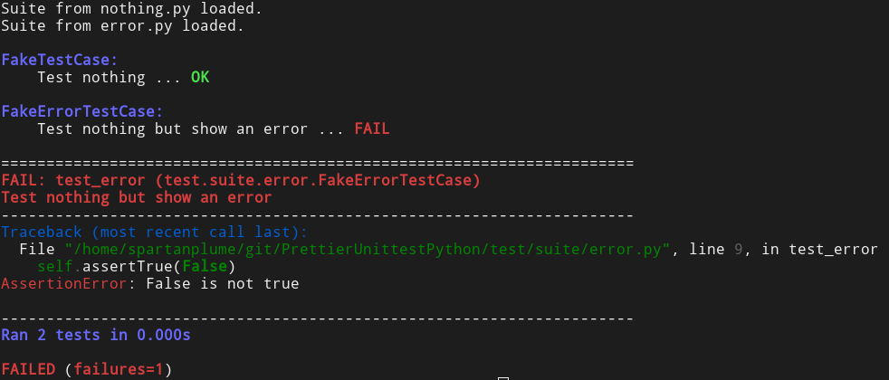

# PrettierUnittestPython

**prettier_unittest** is a python module that will help you to easily create your unittests and have a better rendering when executing them.



## Installation

This module is available via pip:

```sh
pip install prettier-unittest
```

It will also install a `prettier-unittest` binary to use to start the tests. 

## Setup and use

1. Create a folder `test` with an empty `__init__.py` in it.
2. Create a subfolder `suite` in it with an empty `__init__.py` in it.
3. Create a python file with a class inheriting from `unittest.TestCase` and a `suite` function returning a `unittest.TestSuite` in it. Small example:
```python
import unittest

class FakeTestCase(unittest.TestCase):
    def test_nothing(self):
        pass

def suite():
    suite = unittest.TestSuite()
    suite.addTest(FakeTestCase("test_nothing"))
    return suite
```
4. Use the `prettier-unittest` binary in the folder containing the `test` folder.

Note: You can also create subfolders in the `suite` folder to be more organized.

## Alternative

If you don't want to use the `prettier-unittest` binary, you can use the `prettier_unittest` python module to customize the suite loading yourself for example.